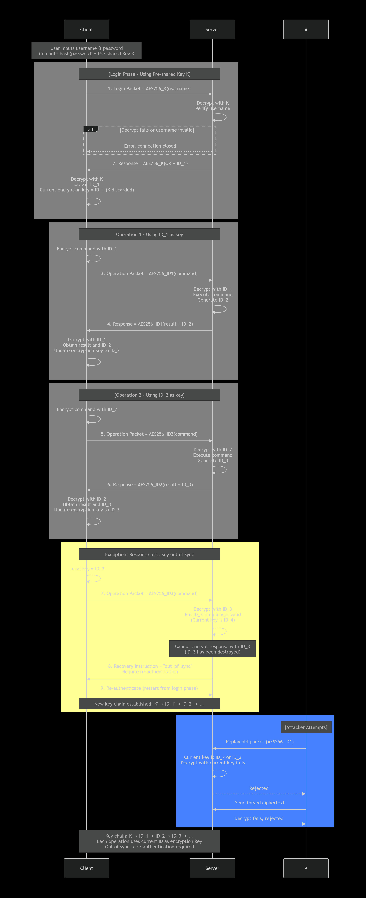

# CHAP-IEM Technical Document

> **NOTE: This protocol is NOT the legacy Challenge-Handshake Authentication Protocol (CHAP).** This is a completely different protocol named Chain Hash Authentication Protocol. CHAP-IEM is a derivative variant of Chain Hash Authentication Protocol.

---

## I. Overview

CHAP-IEM (ID Encryption Mode) is a derivative variant of the standard CHAP protocol. The core difference between the two is that standard CHAP always uses a pre-shared key (user password hash) for encryption, while CHAP-IEM switches to a chained mode where the ID itself serves as the encryption key after login completion.

---

## II. Core Differences from Standard CHAP

| Comparison Dimension | Standard CHAP | CHAP-IEM |
|---------------------|---------------|----------|
| Encryption Key | Always uses pre-shared key K | Uses K during login phase, then switches to current ID |
| Purpose of ID | Session identifier only | Both session identifier and encryption key |
| Key Update | Key K remains fixed | Key changes chained with ID |
| Exception Recovery | Server pushes current ID for sync using K | Automatic sync via K (same as standard CHAP — K retained for recovery channel only) |

---

## III. CHAP-IEM Workflow Details



### 3.1 Login Phase (Same as Standard CHAP)

The client inputs a username and a secret key, then converts the key into a hash value as the pre-shared key K. The client encrypts the username using AES with K and sends it to the server.

The server decrypts using the pre-configured key K and verifies the username validity. Upon successful verification, the server generates ID_1, packages the OK result along with ID_1, encrypts them with K, and returns the packet to the client.

The client decrypts with K and obtains ID_1. At this point, the client holds both K and ID_1. K is retained for potential recovery but is not used for normal operation encryption.

### 3.2 Normal Operation Workflow

**First Operation**

The client uses ID_1 as the encryption key, encrypts the operation command with AES, and sends it to the server.

The server decrypts using ID_1 (since ID_1 was generated and issued by the server in the previous step), executes the operation upon successful decryption, and simultaneously generates a new ID_2. The server encrypts the operation result along with ID_2 using ID_1 (the old ID) and returns the packet to the client.

The client decrypts with ID_1, obtains the operation result and ID_2, then updates its current encryption key to ID_2.

**Second Operation**

The client encrypts the operation command using ID_2. The server decrypts with ID_2, executes the operation, generates ID_3, and returns the result encrypted with ID_2. The client updates its key to ID_3.

And so on, forming a key chain: Login with K → ID_1 → ID_2 → ID_3 → ...

### 3.3 Key Design Points

In each response packet, the server uses the **old ID** to encrypt the new ID when returning it to the client. This means:

- Only the client holding the current valid ID can decrypt and obtain the next ID
- The server does not need to additionally store the encryption key for the new ID; the old ID is naturally the best carrier for encrypting the new ID
- The encryption key updates naturally with each operation, requiring no additional negotiation

### 3.4 Exception Recovery Mechanism

When a response packet is lost, the client's local key remains ID_3, but the server's current valid key has been updated to ID_4.

The client encrypts a new operation using ID_3 and sends it. The server successfully decrypts using ID_3 (since ID_3 was indeed the last issued ID), but finds that ID_3 is no longer valid — the server expects to receive a confirmation or subsequent operation encrypted with ID_3, but the operation window corresponding to ID_3 has already closed, and the server has moved to ID_4 state.

**Recovery Process (using K as the recovery channel):**

1. The server, detecting the out-of-sync condition, encrypts a recovery packet using **K** (the pre-shared key from login):
   ```
   RecoveryPacket = AES256_K("resync" + ID_4 + "please update local ID")
   ```

2. The client decrypts the recovery packet using K (which it has retained since login), obtains ID_4, and updates its current encryption key to ID_4.

3. The client sends an acknowledgment encrypted with ID_4.

4. The server decrypts the acknowledgment using ID_4, verifies successful synchronization, and returns a confirmation. Normal operation resumes with ID_4 as the current key.

**Why this is secure:**
- K is never used for normal operation encryption — it serves only as a recovery channel
- The recovery channel does not compromise forward secrecy: recovering the current ID_4 does not reveal any previous IDs (ID_1, ID_2, ID_3)
- An attacker without K cannot trigger or decrypt recovery packets
- Even if K is compromised, the attacker gains only the ability to obtain the current ID — historical communications remain protected by the destroyed ID chain

**Comparison with Standard CHAP**: In standard CHAP, the server also uses K to push the current ID for synchronization. CHAP-IEM adopts the same recovery mechanism, but K is only used for recovery — normal operations use the ID chain, preserving forward secrecy.

---

## IV. Security Analysis

### 4.1 Attacker Perspective

**Eavesdropping Attack**: The attacker intercepts any ciphertext packet. Since the encryption key changes after each operation and the key derivation path is irreversible (knowing ID_2 does not allow backward derivation of ID_1), the attacker cannot obtain useful information from a single packet.

**Replay Attack**: The attacker replays an old encrypted packet. The server's current valid key has been updated, so decrypting the old packet with the new key will inevitably fail, rendering the replay attack ineffective.

**Forgery Attack**: The attacker sends any forged ciphertext. The server decryption fails and rejects it directly.

### 4.2 Security Comparison with Standard CHAP

| Security Feature | Standard CHAP | CHAP-IEM |
|------------------|---------------|----------|
| Key Fixity | K remains fixed over long term | Keys change continuously |
| Impact of Single Packet Compromise | Can decrypt all subsequent communications | Affects only the current single packet |
| Forward Secrecy | Not supported (K leak compromises everything) | Supported (old keys cannot derive new keys) |
| Sync Mechanism Security | Server pushes sync using K | Server pushes sync using K (recovery channel only) |

### 4.3 Limitations

- When keys become out of sync, a recovery round-trip is required (client → server recovery packet → client ack). This adds latency but does not require re-authentication.
- If the pre-shared key K from the login phase is compromised, an attacker can complete initial authentication and obtain ID_1, and can also trigger recovery to obtain the current ID. However, subsequent communications remain protected by the ID chain, and historical communications remain protected by forward secrecy.

---

## V. Applicable Scenarios

CHAP-IEM is suitable for the following scenarios:

1. Communication environments with forward secrecy requirements
2. Applications that benefit from automatic key rotation per operation
3. Systems that need both forward secrecy and automatic recovery
4. High-security scenarios requiring reduced long-term key exposure risk

Unsuitable scenarios:

1. Environments where maintaining K securely for the entire session duration is not feasible
2. Services that cannot tolerate the additional recovery round-trip latency

---

## VI. Summary

CHAP-IEM introduces the design concept of "ID as key" based on the standard CHAP login workflow. The login phase uses the pre-shared key K for identity authentication and ID_1 distribution, after which it switches to a chained encryption mode using IDs as keys. K is retained as a dedicated recovery channel, enabling automatic synchronization without re-authentication. This design provides forward secrecy through automatic key updates after each operation while maintaining automatic recovery capability — achieving the best of both worlds. The choice between standard CHAP and CHAP-IEM is primarily a trade-off between implementation simplicity (standard CHAP) and forward secrecy (CHAP-IEM).
